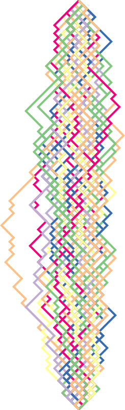

# HALCYON - PIGS might fly

## Drawing 2D SVG Paths

A work in progress.

But hey - it draws something like those Bishop (from a game of chess)
space-time paths; representing a 1D non-relativisitic (goes forwards in time) particle, with constant |momentum| magnitude. 
Colour is qualitatitve just to label the particular path, let's say this is for a free particle + therefore the
action is identical for all paths. 

Time is vertical, but drawn from the top down (t->t+dt), due to the way the SVG format uses the top-left as coordinate (0,0).
